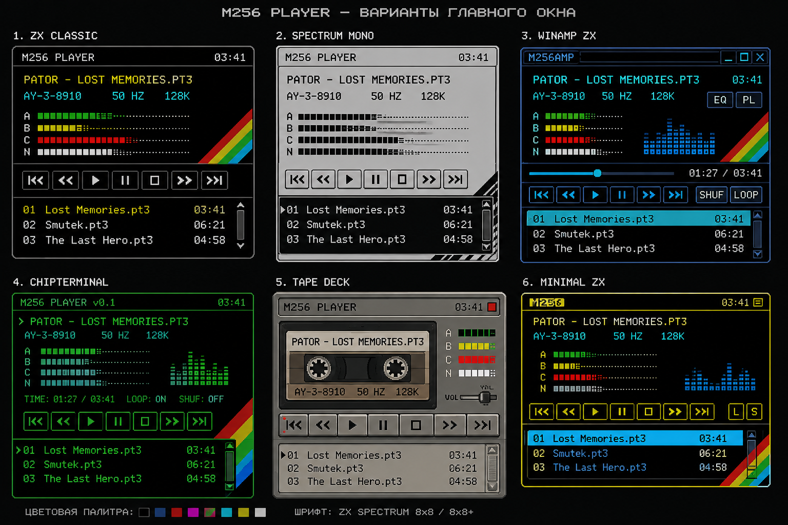

# W100h

**W100h** — маленький музыкальный плеер для старой компьютерной музыки с интерфейсом в духе ZX Spectrum и ранних домашних компьютеров. Название читается как `W100h`: `100h` — это hexadecimal `256`.

Главная идея простая: открыть музыкальный файл двойным кликом или запустить W100h как обычный плеер для своей папки `~/Music`. Никакой игровой логики Mode256 внутри не остаётся; от него используется проверенный музыкальный тракт AY/PT3.

## Как он работает

При обычном запуске без параметров W100h рекурсивно сканирует `~/Music`, собирает поддерживаемые композиции в список и **не начинает играть сам**.

```bash
./r
```

Если передать конкретный файл, он становится текущим и запускается сразу. Именно этот режим используется для файловой ассоциации в Nautilus:

```bash
./r ~/Music/demo.pt3
```

Можно передать каталог — он будет просканирован вместо `~/Music`, но воспроизведение само не стартует:

```bash
./r ~/Music/ZX
```

Первый основной формат — **PT3**, включая поддерживаемые музыкальным ядром двухчиповые 02TS/TurboSound-модули. Другие форматы добавляются отдельно, через собственные декодеры, не ломая существующий AY/PT3 тракт.

## Управление

| Клавиша | Действие |
|---|---|
| `Space` | Play / Pause |
| `Enter` | запустить выбранный трек сначала |
| `←` / `→` | предыдущий / следующий трек и сразу играть |
| `S` | Stop |
| `Esc` | выход |

Темы переключаются через Settings; отдельные горячие клавиши для них не нужны.

## Внешний вид

Окно остаётся одним, компактным и pixel-native: логический размер `320×160`, увеличение только целым nearest-neighbor масштабом. Выбраны три оформления: **№3 Winamp ZX — основное**, **№1 Spectrum Classic** и **№5 Tape Deck**. Диагональная спектрумовская радуга остаётся общим визуальным мотивом.



На раннем макете ещё стоит старое рабочее имя `M256 PLAYER`; для W100h берутся сами компоновки. Рабочими направлениями считаются варианты **1, 3 и 5**; остальные — только поисковые варианты.

## Где что лежит

```text
src/app/       запуск приложения и главный цикл
src/audio/     AY-3-8910, PT3/02TS, SDL audio
src/library/   поиск музыки и построение списка
src/render/    окно и pixel-native framebuffer
src/ui/        интерфейс и bitmap-шрифт
config/        исходные настройки
third_party/   зафиксированные внешние аудиокомпоненты
versions.md    история изменений проекта
```

Локальная сборка и запуск:

```bash
./m
./r
```

Временный масштаб окна можно задать так:

```bash
./r --scale 4
```

Скрипт `a` делает текущий ZIP-архив проекта, `appr` проверяет изменения, формирует сообщение из `versions.md`, затем после подтверждения выполняет commit и push.

Этот README фиксирует назначение и базовый интерфейс W100h. Дальнейшая история разработки ведётся в `versions.md`; сам README больше не изменяется.
